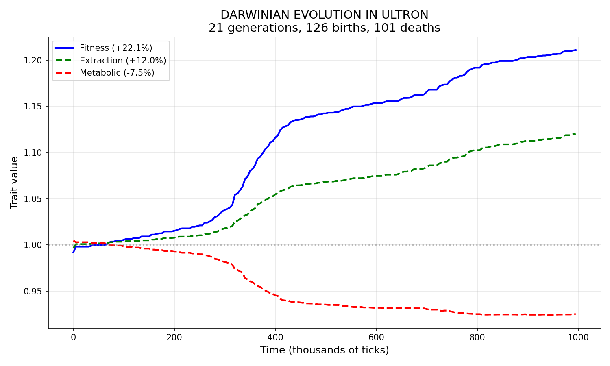
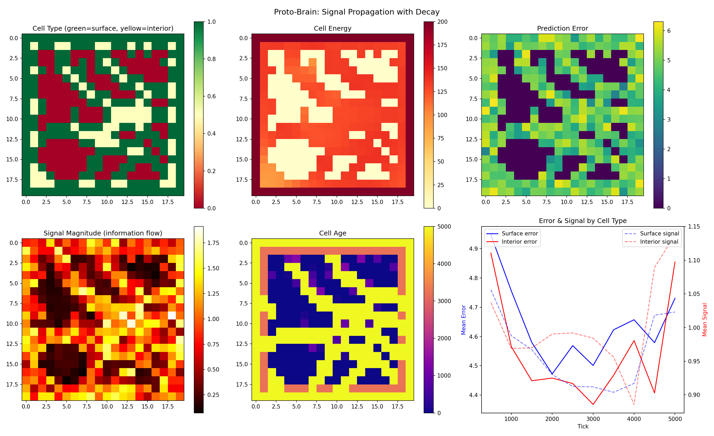
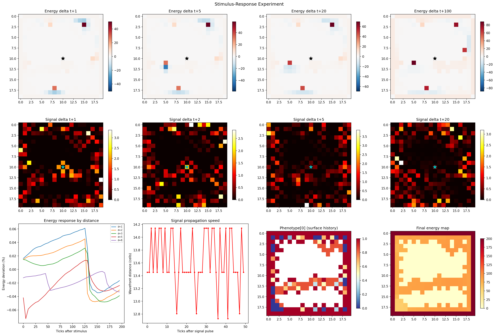

# Ultron

An artificial life engine where digital organisms with neural networks evolve, form multicellular tissues, and develop emergent behaviors — built from scratch in Python with NumPy.

## Why This Exists

Can complex biological phenomena — cell differentiation, predator-prey dynamics, evolutionary arms races — emerge from simple physical rules without being explicitly programmed? Ultron tests this by simulating organisms where each cell contains its own neural network, metabolizes energy, and communicates with neighbors through chemical signals. The behaviors that arise are not designed; they are discovered.

## Architecture

```
┌─────────────────────────────────────────────────────────┐
│                     Environment                         │
│   Resource fields · Spatial gradients · Seasonal cycles │
└──────────────────────────┬──────────────────────────────┘
                           │
              ┌────────────▼────────────┐
              │        Tissue           │
              │   2D grid of cells      │
              │   Signal diffusion      │
              │   Stigmergy fields      │
              │   Resource depletion    │
              └────────────┬────────────┘
                           │
         ┌─────────────────┼─────────────────┐
         │                 │                 │
    ┌────▼────┐       ┌────▼────┐       ┌────▼────┐
    │  Cell   │◄─────►│  Cell   │◄─────►│  Cell   │
    │─────────│signal │─────────│signal │─────────│
    │ Neural  │       │ Neural  │       │ Neural  │
    │ Network │       │ Network │       │ Network │
    │ Energy  │       │ Energy  │       │ Energy  │
    │ Drive   │       │ Drive   │       │ Drive   │
    │ Pheno-  │       │ Pheno-  │       │ Pheno-  │
    │  type   │       │  type   │       │  type   │
    └─────────┘       └─────────┘       └─────────┘
```

Each cell is a complete organism: it senses, predicts, learns, metabolizes, and acts. Cells communicate through diffusing chemical signals, share energy with neighbors, divide when they accumulate surplus, and die (apoptosis) when starved. No central controller exists — all tissue-level behavior is emergent.

## Key Technical Features

- **Neural network per cell** — Each cell has its own weight matrix (Bayesian linear model with learned priors and precision), not a shared global model
- **Metabolic physics** — Energy is conserved: cells consume it to exist, spend it to update weights, earn it by predicting accurately. Death is real and permanent
- **Evolutionary algorithms** — Cells reproduce via mitosis with heritable mutations on birth traits (metabolic rate, extraction efficiency, learning capacity). Natural selection operates on survival
- **Signal propagation** — 4-channel chemical signals diffuse across the grid with distance decay, creating information gradients that drive spatial organization
- **Stigmergy** — Dying cells deposit phenotype traces into the environment. Living cells sense death zones and adapt
- **Predator-prey dynamics** — Organisms can prey on each other's cells. Toxin warfare, camouflage, and pack hunting emerge from evolved action vectors
- **Drive formation** — Cells accumulate internal motivation vectors based on whether their actions reduce prediction error. Drives are not programmed — they are built through experience
- **Cell differentiation** — Surface cells (sensory/absorptive) and interior cells (relay/structural) develop distinct phenotypes through positional experience, not genetic programming

## Results

**Darwinian evolution emerges.** Fitness increases 22% over 21 generations through natural selection on metabolic traits:

<p align="center">
  
</p>

**Proto-brain formation.** Signal corridors and integration hubs self-organize in tissue. Surface cells specialize as sensory organs, interior cells become relay networks:

<p align="center">
  
</p>

**Stimulus-response behavior.** Tissues develop measurable response to localized perturbations, with signal wavefronts propagating at consistent speeds:

<p align="center">
  
</p>

## Experiments

The `experiments/` folder contains 80+ runnable experiments:

| Experiment | What it tests |
|---|---|
| `predator_prey.py` | Lotka-Volterra oscillations from energy-based predation |
| `cambrian.py` | Mass speciation under predation pressure (50×50 grid, 8 founders) |
| `arms_race.py` | Red Queen dynamics via chemical toxin warfare |
| `deep_time.py` | 30,000-tick long-run evolutionary trajectories |
| `proto_brain.py` | Information bottleneck — do signal corridors form? |
| `lamarck_vs_darwin.py` | Lamarckian vs Darwinian selection comparison |
| `ecosystem_experiment.py` | Niche partitioning across 4 resource patches |

## Usage

```bash
# Run the basic simulation (10,000 ticks)
python main.py

# With visualization
python main.py --visualize --ticks 10000

# Run an experiment
python experiments/predator_prey.py
python experiments/cambrian.py
```

## Project Structure

```
ultron/              Core engine (~5,300 lines)
  cell.py            Cell: neural net + energy + signals + drives
  tissue.py          2D grid: diffusion, division, apoptosis, predation
  core.py            State dataclasses, organism creation, reproduction
  tick.py            Simulation loop: sense → predict → compare → update → metabolize
  environments.py    Signal generators (sine, noise, mixed)
  cognition.py       Optional LLM cognitive organ integration
  agency.py          Action execution (file I/O, self-modification)
  senses.py          System perception (filesystem, processes, network)
  observer.py        Non-intervening observation and trend analysis
  config.py          Preset configurations (stable, challenge, minimal)
  visualizer.py      Real-time matplotlib visualization
  batch_engine.py    Parallel experiment runner
  history.py         Experiment persistence and analysis
experiments/         80+ runnable experiment scripts
outputs/             Logs, plots, and result data
docs/                Architecture notes and research journal
viz/                 Web-based visualization server
```

## Tech Stack

Python 3.10+ · NumPy · matplotlib (optional, for visualization)

No PyTorch. No TensorFlow. Every neural network, every evolutionary algorithm, every physics simulation is implemented from scratch.

## License

MIT
